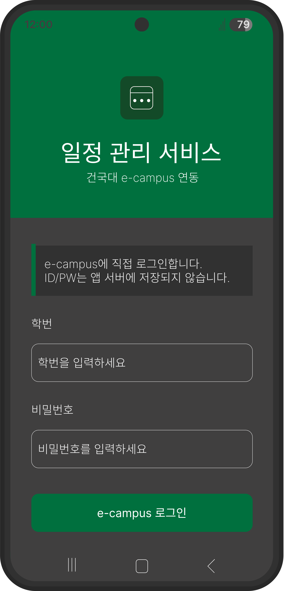
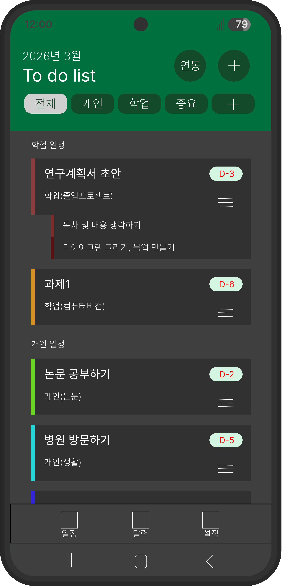
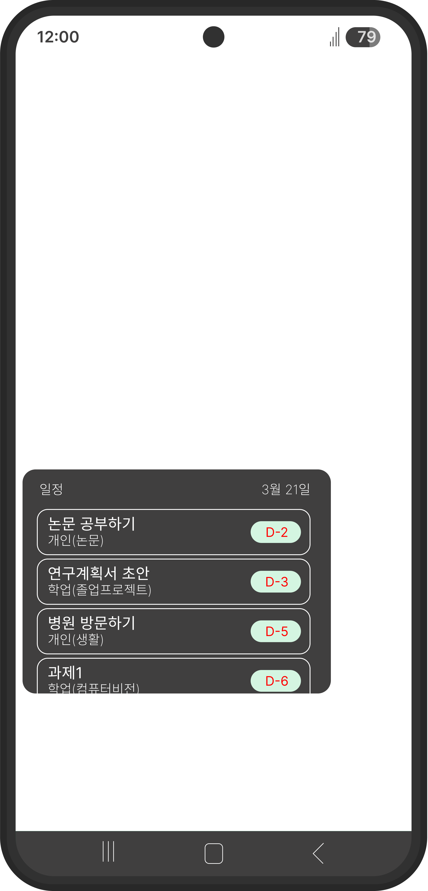

# 일정 관리 서비스
> e-campus To-do list 연동 기반 통합 일정 관리 앱

건국대학교 컴퓨터공학부 졸업프로젝트 1

---

## 개요

건국대학교 학생들은 학업 일정(e-campus)과 개인 일정을 서로 다른 플랫폼에서 
관리하고 있다. 이로 인해 일정 누락과 관리 부담이 발생한다.

본 프로젝트는 e-campus to-do list를 자동으로 수집하여 개인 일정과 함께 
하나의 플랫폼에서 통합 관리할 수 있는 모바일 앱을 개발한다.

---

## 핵심 기능

- e-campus 학업 일정 자동 수집
- 개인 일정 추가 및 수정
- 학업/개인 일정 통합 관리
- 태그, 마감일, 우선순위 기반 정렬
- 알림 및 리마인드
- 홈 화면 위젯 제공

---

## 기술 스택

| 분류 | 기술 |
|------|------|
| 클라이언트 | Flutter |
| 로그인 | WebView (크리덴셜 앱 미저장) |
| 데이터 수집 | HTTP POST + HTML 파싱 |
| 로컬 저장 | flutter_secure_storage |
| 상태 관리 | Provider / Riverpod |

필요 시 클라우드 사용

---

## 보안

- WebView 기반 로그인으로 크리덴셜을 앱에서 직접 수집/저장하지 않음
- 로그인 후 발급된 세션 정보는 암호화하여 기기에 저장

---

## 목업

| 로그인 | 메인 | 일정 추가 | 위젯 |
|--------|------|-----------|------|
|  |  |  |  |

---

## 프로젝트 구조
```
lib/
├── core/           # 공통 상수, 유틸
├── data/           # 데이터 수집, 파싱, 모델
├── presentation/   # 화면 및 UI 컴포넌트
└── providers/      # 상태 관리
```

---

## 팀원

| 이름 | 역할 |
|------|------|
| 이의빈 | |
| 이유환 | |
| 최정길 | |

---

## 진행 상황

- [x] 프로젝트 초기 세팅
- [x] 폴더 구조 설계
- [ ] WebView 로그인 구현
- [ ] e-campus 데이터 수집
- [ ] 메인 화면 구현
- [ ] 개인 일정 CRUD
- [ ] 홈 화면 위젯