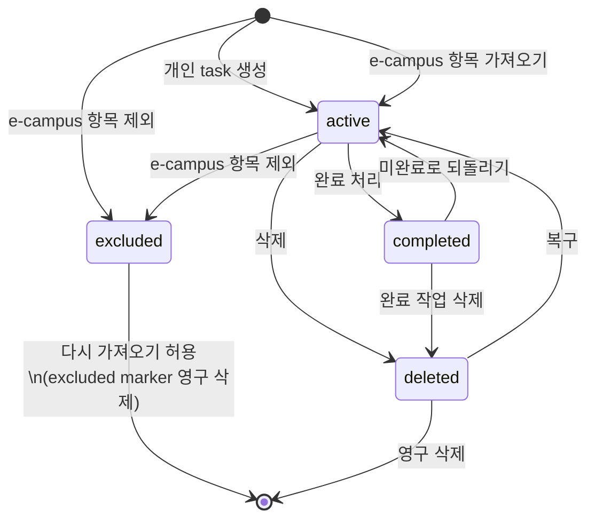

# Task 도메인 모델 명세

## 1. Task

앱의 모든 작업은 Task로 관리한다.
개인 작업과 e-campus 작업은 같은 Task 구조를 사용하되, e-campus 작업에는 동기화 메타데이터를 추가한다.

| 필드 | 타입 | 필수 | 설명 |
| --- | --- | --- | --- |
| `id` | String | 예 | 앱 내부 Task ID |
| `origin` | TaskOrigin | 예 | `personal`, `ecampus` |
| `status` | TaskStatus | 예 | 현재 상태 |
| `title` | String | 예 | 사용자가 보는 제목 |
| `dueDate` | DateTime? | 아니오 | 사용자가 보는 마감일 |
| `priority` | TaskPriority? | 아니오 | 직접 지정한 우선순위 |
| `memo` | String? | 아니오 | 메모 |
| `parentTaskId` | String? | 아니오 | 상위 Task ID |
| `tagIds` | List<String> | 아니오 | 연결된 태그 ID 목록 |
| `folderIds` | List<String> | 아니오 | 연결된 폴더 ID 목록 |
| `sortOrder` | Int | 아니오 | 리스트 정렬용 순서 값 |
| `createdAt` | DateTime | 예 | 생성 시각 |
| `updatedAt` | DateTime | 예 | 수정 시각 |
| `completedAt` | DateTime? | 아니오 | 완료 시각 |
| `deletedAt` | DateTime? | 아니오 | 삭제 시각 |

## 2. TaskOrigin

| 값 | 설명 |
| --- | --- |
| `personal` | 사용자가 직접 만든 작업 |
| `ecampus` | e-campus에서 가져온 작업 |

## 3. TaskStatus

| 값 | 설명 |
| --- | --- |
| `active` | 진행 중 |
| `completed` | 완료됨 |
| `deleted` | 삭제됨 |
| `excluded` | e-campus에서 발견됐지만 가져오지 않음 |

`excluded`는 e-campus 항목에만 사용한다.

## 4. 상태 전이

삭제는 즉시 영구 삭제하지 않고 `deleted` 상태로 남긴다.
`excluded`는 실제 작업으로 복구하지 않고 제외 marker를 영구 삭제해 다음 e-campus 동기화에서 다시 신규 후보로 나타날 수 있게 한다.

| 전이 | 대상 | 트리거 |
| --- | --- | --- |
| 생성 없음 -> `active` | 개인, e-campus | 개인 task 생성 또는 e-campus 항목 가져오기 |
| 생성 없음 -> `excluded` | e-campus | 동기화 결과에서 가져오지 않기로 선택 |
| `active` -> `completed` | 개인, e-campus | 완료 처리 또는 동기화에서 원본 누락/마감 전 조건 충족 |
| `completed` -> `active` | 개인, e-campus | 미완료로 되돌리기 |
| `active` -> `deleted` | 개인, e-campus | 삭제 |
| `completed` -> `deleted` | 개인, e-campus | 완료 작업 삭제 |
| `deleted` -> `active` | 개인, e-campus | 복구 |
| `active` -> `excluded` | e-campus | 이미 가져온 e-campus 항목을 제외 처리 |
| `excluded` -> 종료 | e-campus | 다시 가져오기 허용 또는 영구 삭제 |
| `deleted` -> 종료 | 개인, e-campus | 영구 삭제 |

## 5. EcampusSyncMetadata

e-campus 작업에만 붙는 원본 추적 정보이다.

| 필드 | 타입 | 필수 | 설명 |
| --- | --- | --- | --- |
| `sourceKey` | String | 예 | e-campus 항목 식별용 내부 키 |
| `sourceTitle` | String? | 아니오 | e-campus 원본 제목 |
| `sourceDueDate` | DateTime? | 아니오 | e-campus 원본 마감일 |
| `sourceCourse` | String? | 아니오 | 과목명 |
| `sourceType` | EcampusTaskType? | 아니오 | 과제, 온라인강의 등 |
| `lastSyncedAt` | DateTime? | 아니오 | 마지막 동기화 시각 |

`sourceKey`는 e-campus HTML에 그대로 존재하는 필드명이 아니다.
파싱한 값을 조합해서 앱 내부에서 만든다.

## 6. SubTask

| 필드 | 타입 | 필수 | 설명 |
| --- | --- | --- | --- |
| `id` | String | 예 | SubTask ID |
| `taskId` | String | 예 | 상위 Task ID |
| `title` | String | 예 | 제목 |
| `isDone` | Boolean | 예 | 완료 여부 |
| `createdAt` | DateTime | 예 | 생성 시각 |
| `updatedAt` | DateTime | 예 | 수정 시각 |

## 7. Tag

| 필드 | 타입 | 필수 | 설명 |
| --- | --- | --- | --- |
| `id` | String | 예 | 태그 ID |
| `name` | String | 예 | 태그 이름 |
| `color` | String | 예 | 표시 색상 값 |
| `createdAt` | DateTime | 예 | 생성 시각 |
| `updatedAt` | DateTime | 예 | 수정 시각 |

태그 기본 우선순위 필드는 현재 구현되어 있지 않다.

## 8. Folder

| 필드 | 타입 | 필수 | 설명 |
| --- | --- | --- | --- |
| `id` | String | 예 | 폴더 ID |
| `name` | String | 예 | 폴더 이름 |
| `color` | String? | 아니오 | 표시 색상 값 |
| `icon` | String? | 아니오 | 아이콘 이름 |
| `parentFolderId` | String? | 아니오 | 상위 폴더 ID (중첩 폴더 지원) |
| `sortOrder` | Int | 아니오 | 폴더 정렬 순서 |
| `createdAt` | DateTime | 예 | 생성 시각 |
| `updatedAt` | DateTime | 예 | 수정 시각 |

## 9. NotificationSetting

| 필드 | 타입 | 필수 | 설명 |
| --- | --- | --- | --- |
| `id` | String | 예 | 알림 ID |
| `taskId` | String | 예 | 연결된 Task ID |
| `enabled` | Boolean | 예 | 알림 사용 여부 |
| `daysBeforeDue` | Int | 예 | 마감 몇 분 전 알림인지. 필드명과 달리 분 단위 |
| `notifyTime` | String | 예 | 알림 시간 또는 방식. 현재 기본 설정은 `relative` |
| `scheduledAt` | DateTime? | 아니오 | 실제 예약된 알림 시각 |

## 10. AppSettings

설정은 `AppSettings` key-value 테이블에 저장한다.

| 필드 | 타입 | 설명 |
| --- | --- | --- |
| `defaultNotificationEnabled` | Boolean | 기본 알림 사용 여부 |
| `defaultNotificationDays` | Int | 기본 알림 오프셋. 현재 분 단위 |
| `defaultNotificationTime` | String | 기본 알림 방식 |
| `urgentDueDays` | Int | 홈 마감 임박 기준 |
| `homeSelectedTagId` | String? | 홈에서 선택한 태그 |
| `hiddenTagIds` | Set<String> | 숨긴 태그 목록 |
| `hiddenFolderIds` | Set<String> | 숨긴 폴더 목록 |
| `tagFolderIds` | Map<String, String> | 태그-폴더 매핑 |
| `tagSortOrders` | Map<String, Int> | 태그 표시 순서 |
| `ecampusFolderId` | String? | e-campus 자동 폴더 ID |

`autoSyncEnabled`, `saveEcampusAccount` 필드도 모델에는 남아 있지만 현재 UI에서는 사용하지 않는다.
