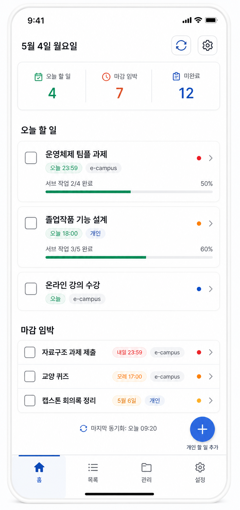
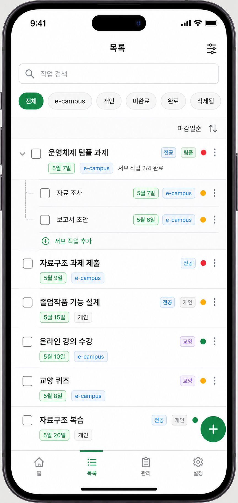
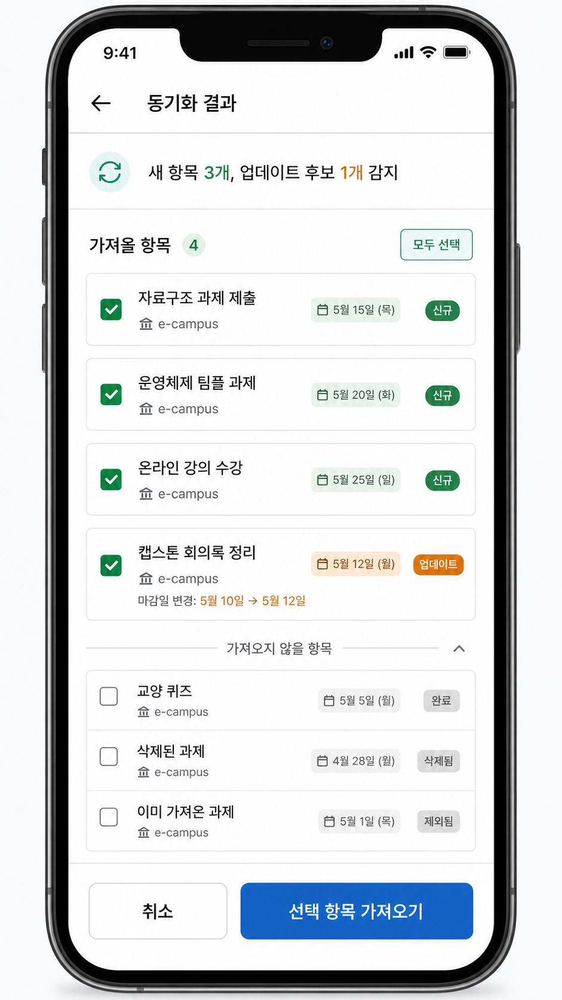
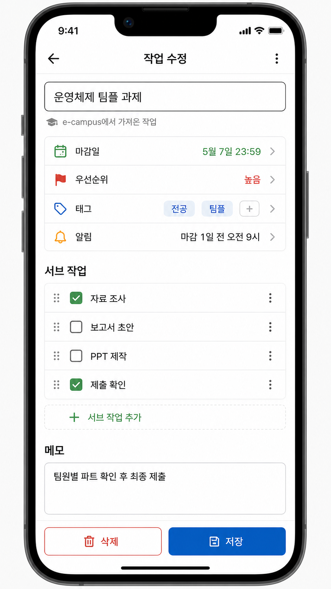
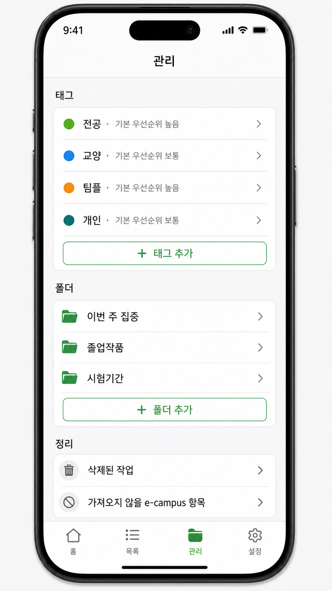
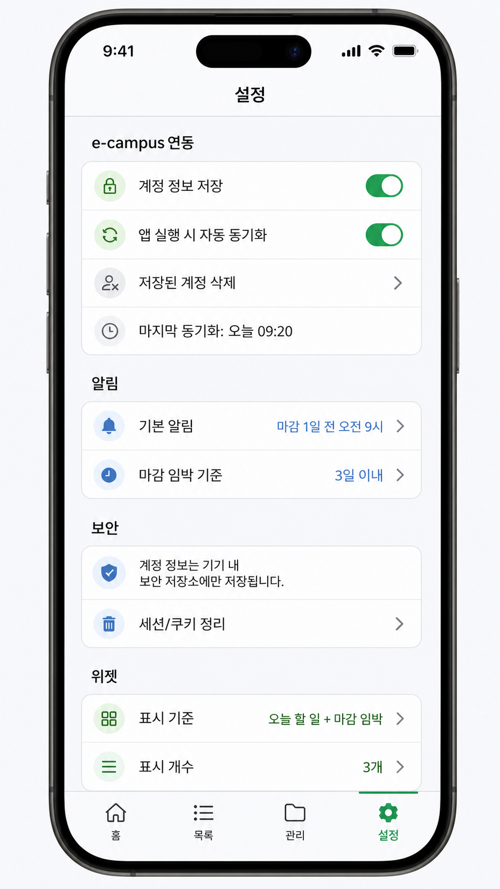

# 화면 흐름

## 1. 전체 탭 구조

하단 탭은 4개로 구성한다.

```text
홈 / 목록 / 관리 / 설정
```

| 탭 | 역할 |
| --- | --- |
| 홈 | 오늘 할 일, 마감 임박, 요약, 동기화 상태 확인 |
| 목록 | 전체 task 조회, 필터, 정렬 |
| 관리 | 태그, 폴더, 삭제된 task, 제외된 e-campus 항목 관리 |
| 설정 | e-campus 동기화 실행, 로그인 세션, 알림, 홈 표시 기준 |

## 2. 홈 화면



### 주요 구성

- 오늘 날짜
- 동기화 아이콘
- 설정 진입 아이콘
- 오늘 할 일 개수
- 마감 임박 개수
- 미완료 개수
- 마감 지남 개수
- 오늘 할 일 섹션
- 마감 임박 섹션
- 태그별 작업 섹션
- 마감 지남 섹션
- 개인 task 빠른 추가 버튼
- 하단 탭 바

### 표시 정책

- 홈은 전체 task 목록이 아니라 오늘 할 일과 마감 임박 task 중심으로 보여준다.
- 마감 임박 기본 기준은 오늘 포함 3일 이내이다.
- 마감 임박 기준 기간은 설정에서 변경할 수 있다.
- 오늘 할 일에 이미 표시된 task는 마감 임박 섹션에서 중복 표시하지 않는다.
- sub task가 있는 parent task는 `서브 작업 완료 수 / 전체 수`와 진행률 바를 표시한다.
- 홈에서는 sub task 목록을 직접 펼치지 않는다.
- 오늘 할 일은 최대 3개, 마감 임박/마감 지남은 최대 4개를 홈에 표시한다.

## 3. 목록 화면



### 주요 구성

- 필터 메뉴
- 정렬 메뉴
- task 리스트
- sub task 진행률 표시
- 사용자 지정 정렬일 때 목록 재정렬
- 완료 작업 전체 삭제 버튼(완료 필터에서 표시)
- 개인 task 추가 버튼
- 하단 탭 바

### 필터

- 전체
- e-campus
- 개인
- 미완료
- 완료
- 마감 지남
- 삭제됨

### 정렬

- 사용자 지정
- 마감일순
- 우선순위순
- 생성일순

## 4. 동기화 결과 화면



### 주요 구성

- 동기화 결과 요약
- 가져올 항목
- 가져오지 않을 항목
- 오류 항목
- 가져오기/제외 선택
- 선택 항목 가져오기 버튼

### 분류 정책

`가져올 항목`에는 다음 항목을 표시한다.

- 신규 e-campus 항목
- 업데이트 후보 항목

`가져오지 않을 항목`에는 다음 항목을 표시한다.

- 이미 가져온 항목
- 완료된 항목
- 삭제된 항목
- 제외된 항목

파싱 실패 또는 sourceKey 생성 실패 항목은 오류 항목으로 분리한다. 사용자가 선택한 가져오기 항목만 앱 task에 반영하고, 선택하지 않고 제외한 항목은 `excluded` 상태로 저장할 수 있다.

## 5. 작업 상세/수정 화면



### 주요 구성

- 제목
- 출처 정보
- 마감일
- 우선순위
- 태그
- 알림
- sub task 목록
- sub task 추가
- 메모
- 저장
- 삭제

### 정책

- 개인 task와 e-campus task 모두 같은 상세/수정 화면을 사용한다.
- e-campus task도 제목, 마감일, 태그, 우선순위, 알림, 메모를 수정할 수 있다.
- e-campus task는 화면 내에서 출처만 표시한다.

## 6. 관리 화면



### 주요 구성

- 태그 목록
- 태그 추가
- 폴더 목록
- 폴더 추가
- 삭제된 작업
- 가져오지 않을 e-campus 항목

### 정책

- 태그와 폴더는 관리 탭에서 생성, 수정, 삭제한다.
- 삭제된 task는 복구하거나 완전 삭제할 수 있다.
- 제외된 e-campus 항목은 다시 가져올 수 있도록 관리한다.

## 7. 설정 화면



### 주요 구성

- e-campus 동기화 실행
- 로그인 세션 상태
- 마지막 동기화 시간
- 세션/쿠키 정리
- 기본 알림
- 알림 시점
- 마감 임박 기준

현재 설정 화면에는 계정 정보 저장, 앱 실행 시 자동 동기화, 위젯 설정 UI가 없다. e-campus 로그인은 WebView 세션 기반이며 아이디와 비밀번호를 저장하지 않는다.

## 8. 주요 이동 흐름

### 개인 task 생성

```text
홈 또는 목록
→ 추가 버튼
→ 작업 생성 화면
→ 저장
→ 홈 또는 목록 반영
```

### e-campus 동기화

```text
홈
→ 동기화 아이콘
→ e-campus 동기화 상태 화면
→ 필요한 경우 WebView 로그인
→ todo 가져오기 및 기존 작업 비교
→ 동기화 결과 화면
→ 선택 항목 가져오기 또는 제외
→ 홈/목록 반영
```

### task 수정

```text
홈 또는 목록
→ task 선택
→ 작업 상세/수정 화면
→ 저장
→ 이전 화면 반영
```

### 태그/폴더 관리

```text
관리
→ 태그 또는 폴더 선택
→ 생성/수정/삭제
→ 목록 필터 또는 task 편집 화면에서 사용
```
